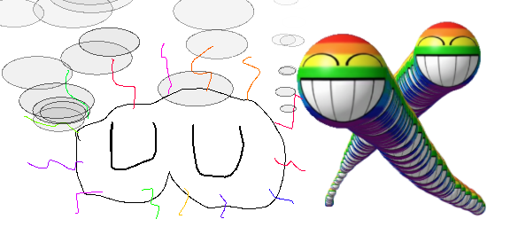

# ペイントアプリ

## 起動方法
`./run.sh` をダブルクリックして起動

## 操作方法

### マウス
- **左クリック + ドラッグ**: 線を描画
- **ホイール**: 上下スクロール

### キーボード
- **Space**: ズーム選択モード（ドラッグで範囲選択）
- **P**: サーマルプリンターへ印刷
- **Cmd + S**: PNG画像として保存ダイアログ
- **Cmd + Z**: アンドゥ
- **Cmd + Shift + Z**: リドゥ
- **↑↓**: スクロール
- **Tab** (押しっぱなし): デバッグ情報表示
- **ESC**: アプリケーション終了

### MIDIコントローラー
MIDIコントローラーを接続すると自動認識され、ノブやパッドで以下の操作が可能：
- ブラシサイズ調整
- アニメーション速度調整
- カラー選択